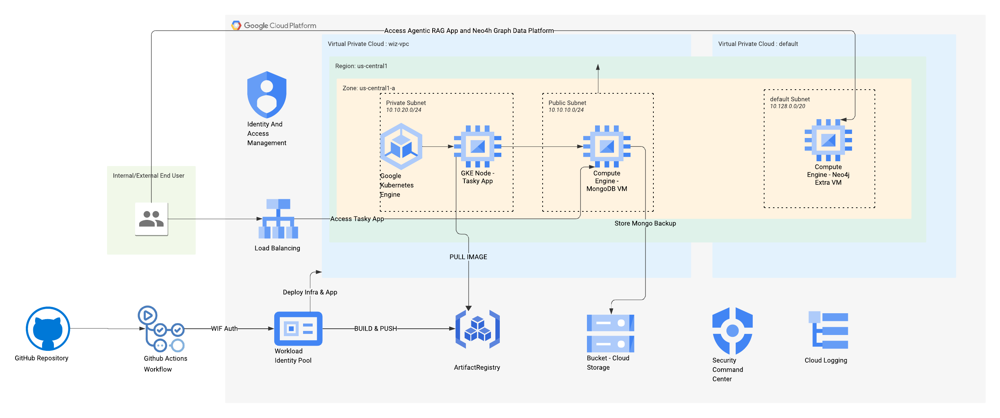

# Wiz Technical Exercise - [Sumit Shatwara]

## 1. Overview

This repository contains the solution for the Wiz Technical Exercise. The goal was to deploy a three-tier web application on Google Cloud Platform (GCP) with intentional configuration weaknesses, demonstrate detection and remediation of these weaknesses using native GCP security tools, leverage DevOps practices for automation, and implement security controls.

*   **Chosen Cloud Provider:** Google Cloud Platform (GCP)
*   **Key Areas Demonstrated:** Cloud Architecture, DevOps (IaC, CI/CD), Cybersecurity (Detection, Prevention, Audit), Kubernetes, GCP Services.

## 2. Architecture

The deployed infrastructure consists of a three-tier web application:

1.  **Web Tier:** A containerized 'Tasky' web application deployed on Google Kubernetes Engine (GKE).
2.  **Database Tier:** An outdated MongoDB server (v4.4) running on a Google Compute Engine (GCE) VM.
3.  **Storage Tier:** Google Cloud Storage (GCS) used for storing database backups.

Outbound internet connectivity for private resources (like GKE nodes if configured without public IPs and needed to fetch updates without a public IP) is facilitated by **Cloud NAT**.

**Architecture Diagram:**

 

**Key GCP Services Used:**
*   Google Kubernetes Engine (GKE)
*   Google Compute Engine (GCE)
*   Google Cloud Storage (GCS)
*   Google Artifact Registry (for container images)
*   Google Cloud NAT & Cloud Router
*   Google Security Command Center (SCC)
*   Google Cloud Audit Logs
*   GCP IAM & Service Accounts
*   GCP VPC Network, Firewall Rules, Load Balancer

## 3. Intentional Weaknesses Implemented

The following intentional configuration weaknesses were built into the environment as per the exercise requirements:

1.  **Outdated Database Server & OS (Database Tier):**
    *   GCE VM running an outdated Linux version (Ubuntu 20.04).
    *   Outdated MongoDB server (v4.4) installed on this VM.
    *   *Risk:* Vulnerable to known exploits targeting the OS or database version.
2.  **Database VM SSH Access from Internet (Database Tier):**
    *   GCE VM configured to allow SSH connections (TCP/22) from anywhere on the internet (`0.0.0.0/0`).
    *   *Risk:* Exposes the VM to brute-force attacks and unauthorized access attempts.
3.  **Overly Permissive IAM for Database VM (Database Tier):**
    *   The GCE VM's service account was granted overly permissive GCP IAM roles (e.g., Project Editor).
    *   *Risk:* If the VM is compromised, the attacker gains broad access to GCP resources within the project, enabling lateral movement and privilege escalation.
4.  **Publicly Readable/Listable Cloud Object Storage (Storage Tier):**
    *   GCS bucket storing database backups configured to allow public read access to objects and public listing of bucket contents.
    *   *Risk:* Sensitive database backup data exposed to unauthorized individuals, leading to data breaches.
5.  **Container Running with Cluster-Admin Privileges (Web Tier):**
    *   The web application container deployed on GKE was configured to run with `cluster-admin` privileges within the Kubernetes cluster.
    *   *Risk:* If the container is compromised, the attacker gains full administrative control over the GKE cluster, allowing them to deploy malicious workloads, access secrets, or disrupt operations.

## 4. DevOps Automation (IaC & CI/CD)

Modern DevOps practices were used to automate infrastructure provisioning and application deployment.

*   **Version Control System (VCS):**
    *   This GitHub repository: `[https://github.com/sumit-private-org/wiz-exercise]`

*   **Infrastructure as Code (IaC):**
    *   **Tool:** Terraform
    *   **Description:** Terraform was used to define and provision all core GCP resources including VPC, subnets, firewall rules, GCE VM, GCS bucket, GKE cluster, Cloud NAT, Cloud Router, Artifact Registry, IAM roles, and service accounts.
    *   **Code Location:** `[terraform/]`

*   **CI/CD Pipelines (GitHub Actions):**
    *   Authentication to GCP from GitHub Actions was securely handled using **Workload Identity Federation**, eliminating the need for static service account keys.
    *   **Infrastructure Pipeline:**
        *   **Purpose:** To automatically plan and apply Terraform configurations to deploy or update the cloud infrastructure.
        *   **Trigger:** On manual trigger (workflow_dispatch).
        *   **Key Steps:** Checkout code, Setup Terraform, Authenticate to GCP (WIF), `terraform init`, `terraform validate`, `terraform plan`, `terraform apply`.
        *   **Workflow File:** `[.github/workflows/infra_deploy_terraform.yaml]`
    *   **Application Pipeline:**
        *   **Purpose:** To automatically build the containerized web application and push it to Google Artifact Registry.
        *   **Trigger:** On push to the main branch when changes occur in app1/**. On push to the main branch when changes occur in .github/workflows/app_build_push.yml (the workflow file itself). On manual trigger (workflow_dispatch).
        *   **Key Steps:** Checkout code, Authenticate to GCP (WIF), Setup up Cloud SDK, Login to Artifact Registry, Setup Docker Buildx, Build and Push Docker image.
        *   **Container Registry:** Google Artifact Registry (`us-central1-docker.pkg.dev/clgcporg10-183/wiz-app-repo/tasky-app:latest`)
        *   **Workflow File:** `[.github/workflows/app_build_push.yml]`

    *   **GKE Deployment Pipeline:**
        *   **Purpose:** To automatically deploy the containerized web application's Kubernetes manifests to the Google Kubernetes Engine (GKE) cluster.
        *   **Trigger:** On push to the main branch when changes occur in app1/k8s/** (Kubernetes manifests). On push to the main branch when changes occur in .github/workflows/deploy_to_gke.yml (the workflow file itself). On manual trigger (workflow_dispatch).
        *   **Key Steps:** Checkout code, Authenticate to Google Cloud Platform using Workload Identity Federation, Get GKE cluster credentials, Apply RBAC permissions for the GitHub Actions Service Account within the GKE cluster, Deploy Kubernetes manifests from the app1/k8s/ directory, Verify the application deployment rollout status.
        *   **Target GKE Cluster:**  Cluster Name: `wiz-cluster`
        *   **Workflow File:** `[.github/workflows/deploy_to_gke.yml]`


## 5. Environment Setup & Application Details

*   **Web Tier (GKE - 'Tasky' Application):**
    *   A containerized 'Tasky' web application was deployed on a GKE cluster.
    *   The application image was built and pushed to Google Artifact Registry.
    *   Publicly accessible via a GCP Load Balancer (Example URL: `[http://<LOAD_BALANCER_IP>:80]`).
    *   The container image includes a file named `wizexercise.txt` with content, verified via `kubectl exec`.
    *   The application pods were configured with a ServiceAccount bound to the `cluster-admin` ClusterRole (intentional weakness).

*   **Database Tier (GCE - MongoDB):**
    *   A GCE VM was provisioned using an outdated Linux image (Ubuntu 20.04 LTS).
    *   An outdated version of MongoDB (v4.4) was installed.
    *   SSH access was initially configured from `0.0.0.0/0`.
    *   MongoDB was configured for local authentication, and the connection string was passed to the web application via a Kubernetes Secret.
    *   The VM was assigned a service account with overly permissive Project Editor IAM roles.

*   **Storage Tier (GCS - Database Backups):**
    *   A GCS bucket (`[wiz-exercise-backups-clgcporg10-183]`) was created.
    *   Permissions were set to allow public read access to objects and public listing of bucket contents.
    *   A cron job on the DB VM was set up to automate `mongodump` backups and upload them to this GCS bucket using `gsutil`.
    *   Example public backup URL: `[https://storage.googleapis.com/wiz-exercise-backups-clgcporg10-183/backups/mongodb_backup_20250508_110211.gz]`

## 6. Cloud Detection & Response

*   **CSP Security Tool Used:** **Google Security Command Center (SCC)**, primarily leveraging `Findings`(Security Health Analytics) of it.

*   **Detection of Weaknesses with SCC:**
    *   **Public GCS Bucket:** SCC detected the publicly accessible GCS bucket (e.g., via `PUBLIC_BUCKET_ACL` finding).
    *   **Open SSH Firewall Rule:** SCC detected the overly permissive firewall rule allowing SSH from `0.0.0.0/0` (e.g., via `OPEN_SSH_PORT` finding).
    *   **Public VM:** SCC identified the GCE VM with external IP Address(e.g., via `PUBLIC_IP_ADDRESS` finding).
    *   **Privileged Container:** GKE container running as a root.

*   **Implemented Security Controls:**
    *   **Preventative Controls:**
        1.  **Workload Identity Federation:** Implemented for GitHub Actions CI/CD pipelines to authenticate to GCP. This prevents the need for static service account keys, mitigating risks associated with key leakage and management.
        2.  **Network Policy within GKE:** Implemented Network Policy by enabling Dataplane V2 CNI plugin in GKE restricting outbount internet connectivity of tasky application running as a container.
    *   **Detective Controls:**
        1.  **Security Command Center (SCC) Findings:** The primary detective control, automatically identifying misconfigurations and vulnerabilities as listed above.
        2.  **Cloud Audit Log Monitoring:** Specific queries were used in Logs Explorer to detect risky actions. For example:
            *   **Detecting SA Key Creation:**
                ```text
                resource.type="iam_service_account"
                protoPayload.methodName="google.iam.admin.v1.CreateServiceAccountKey"
                ```
            *   **Detecting Public GCS Bucket Policy Change:**
                ```text
                resource.type="gcs_bucket"
                resource.labels.bucket_name="wiz-exercise-backups-clgcporg10-183" 
                protoPayload.methodName="storage.setIamPermissions"
                protoPayload.serviceData.policyDelta.bindingDeltas.action="ADD" 
                protoPayload.serviceData.policyDelta.bindingDeltas.role="roles/storage.objectViewer"
                protoPayload.serviceData.policyDelta.bindingDeltas.member="allUsers"
                ```

*   **Control Plane Audit Logging:**
    *   Cloud Audit Logs (Admin Activity, System Event, and optionally Data Access) were enabled by default or verified.
    *   A sample event, such as the `ONE_TO_ONE_NAT` action for GCE VM or a `SetIamPolicy` call with editor role to a service account, was shown from Logs Explorer to demonstrate auditability.

*   **Simulated Attack & Efficacy:**
    *   **Attack 1 (Outbound Internet Access):** Attempt to access internet connectivity within GKE Pod.
        *   *Prevention:* An Egress Network Policy  would block internet traffic.
    *   **Attack 2 (SA Key Creation for Persistence):** Simulated an attacker creating a new service account key.
        *   *Detection:* The `CreateServiceAccountKey` event was found in Cloud Audit Logs. Alert is generated within seconds to proactively detect it.

## 7. How to Run/Deploy (High-Level)

**Prerequisites:**
*   Google Cloud SDK (`gcloud`) installed and authenticated.
*   Terraform CLI installed.
*   A GCP Project with billing enabled.
*   Permissions to create resources and manage IAM in the GCP project.
*   GitHub account for forking/cloning and running GitHub Actions.

**Steps:**
1.  Clone this repository.
2.  Configure GCP Project and Workload Identity Federation for GitHub Actions.
3.  Update Terraform variables (e.g., `project_id` in `terraform.tfvars` or backend configuration).
4.  **Infrastructure Deployment:**
    *   Push changes to the main branch (or manually trigger the Terraform GitHub Actions workflow).
    *   Alternatively, run Terraform commands locally: `terraform init`, `terraform plan`, `terraform apply`.
5.  **Application Deployment:**
    *   Push changes to the application code (if modified) to trigger the application build/push pipeline.
    *   The GKE deployment will use the image specified (which should be built by the pipeline).


## 8. Extra Credit

*   **Agentic RAG Application along with Neo4j Graph Database and Graph Analytics for Cloud Security Analysis:**
    Leveraging my background as a Neo4j Solutions Engineer, I conceptualized and have experience building an Agentic RAG (Retrieval Augmented Generation) application. This application utilizes a Neo4j Graph Database as its knowledge base, populated with sample AWS Cloud resources and their associated configuration data.
    *   **Primary Use Case:** To identify cloud misconfigurations by querying the graph for patterns indicative of weaknesses. This application is written in Python using Streamlit framework, Langchain Agents and Neo4j plugin, and stored in `app2/` location.
    *   **Advanced Use Cases Showcased:**
        *   **Lateral Movement Path Analysis:** Using Neo4j Graph Visualization to identify potential attack paths an adversary could take by exploiting interconnected misconfigurations and overly permissive access.
        *   **Risk Prioritization:** Applying graph-based centrality algorithms based on connectivity and asset criticality to prioritize the remediation of misconfigurations that pose the greatest risk or are key enablers for widespread compromise.
    
    This approach demonstrates how graph technology can provide deeper insights into complex cloud environments, moving beyond simple list-based findings to understand the relationships and "toxic combinations" of risks – a core tenet of modern cloud security posture management that aligns with Wiz's value proposition.